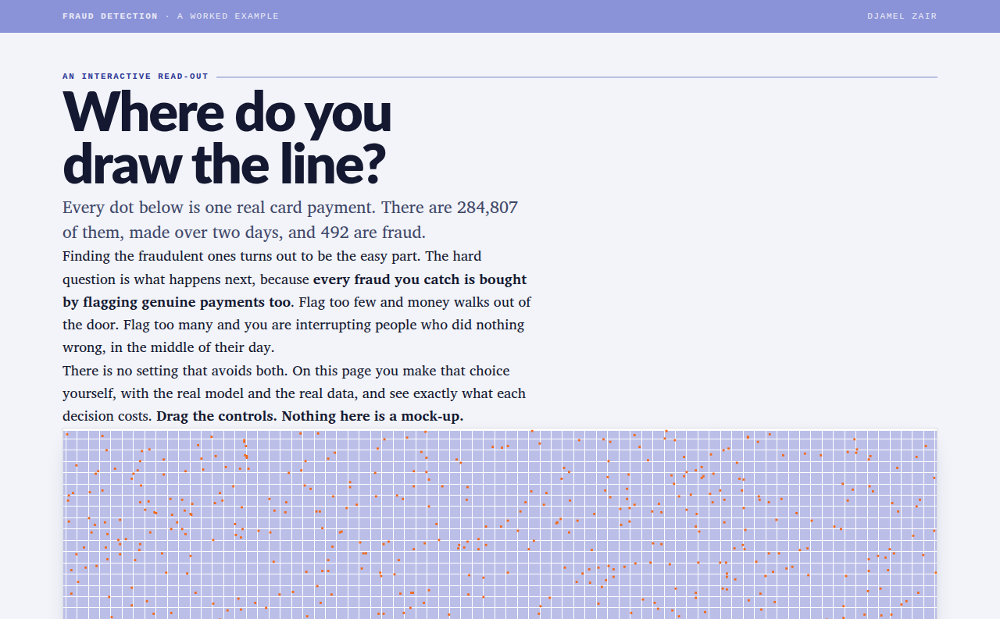

# Fraud detection under extreme class imbalance

**Detecting card fraud when only 1 payment in 578 is fraudulent, and deciding what to do about it.**

[](https://djamelzair.github.io/FraudImbalanceExampleRaboApplication/)

📊 **[Open the interactive read-out](https://djamelzair.github.io/FraudImbalanceExampleRaboApplication/)**. Move the assumptions yourself: how many payments to stop, what an alert costs, how rare fraud is, and whether the answer survives a resample. Written for non-specialists, no statistics required.

📓 **[Read the full notebook](https://djamelzair.github.io/FraudImbalanceExampleRaboApplication/notebook.html)**. Every chart interactive, all the reasoning in order.

---

## What this is

Most fraud-detection notebooks stop at a model and a score. The hard part of this problem is everything that comes after: how much confidence the numbers deserve, what an error actually costs, and what a bank should *do* when the model is unsure.

This notebook is about that second half.

284,807 real card transactions over two days. 492 are fraudulent, which is 0.173%. A model that labels every transaction as legitimate scores **99.83% accuracy** and catches nothing. Every evaluation decision here follows from that single fact.

## Result on the untouched test period

The final model and policy were locked before the test period was scored, and evaluated exactly once.

| | |
|---|---|
| Fraud caught | **64 of 74** (86%) |
| Genuine payments flagged for action | **114 of 56,672** (0.20%) |
| Genuine payments given a light automated check | **2,439 of 56,672** (4.3%) |
| Precision of the strongest band | **91%**. 50 of its 55 flags were genuine fraud |
| Average precision | **0.78**, 95% interval **[0.68, 0.86]** |

The interval is the honest headline. With 74 fraud cases in the test period, a single number quoted to three decimal places would be false precision.

## What this notebook does that most do not

Every headline number carries a bootstrap interval. Where two models are compared the bootstrap is *paired*, both scored on the same resampled transactions, which is how the calibrated model can be shown to win in 100% of resamples even though the two intervals overlap almost entirely.

The two errors are not treated as interchangeable. Missed fraud is costed at the value of that specific transaction, because the data contains it. A false alert is costed per alert, and since nobody has told me what that is worth it gets swept across a plausible range instead of guessed once. Across that range the cost-optimal operating point moves more than twentyfold. Hold the assumption fixed and resample the data instead, and it still moves by a factor of two. So no single "optimal" threshold is shipped, because there isn't one.

What is shipped is a graded response. Rather than one cut-off, the calibrated probability drives four graded responses: no flag, a light automated check, human review, and act immediately. What acting means, holding a payment or blocking a card, is the bank's operational decision and the notebook does not presume it. Matched on fraud caught, that cuts the cost of customer disruption by 98% against a single blocking threshold (measured on the validation period), because a wrong verification costs a customer a few seconds and a wrong decline costs them a refused payment at a till.

Resampling was tested rather than dismissed. SMOTE is the standard answer to imbalance in the published work on this dataset, so the notebook runs it head to head against class weighting under identical conditions, and reports what actually happened along with what it does to the calibration the cost model depends on.

There is also a section on who carries the false alarms. No protected attributes exist in this data, and the notebook says so instead of faking an audit. What can be tested is tested: on the test period the smallest payments are flagged at 2.3 times the average rate and the largest at 2.1 times, a U shape rather than the tidier story that small payments are penalised. On the earlier validation period the smallest were at 2.8 times and the largest close to normal, so the pattern is real but not stable. The notebook then implements a cap on the disparity and prices it at one fraud case.

Interpretability gets priced in fraud cases rather than in metrics. At an equal budget of 50 alerts on the validation period, the transparent logistic model catches 10 fewer frauds than the calibrated one. That is the form the trade-off should take in a conversation with risk and compliance.

Finally, the notebook predicts its own degradation and then checks the prediction. Precision was expected to move between periods purely because the fraud rate changed. Written down before the test scores existed, the prediction was 2.6%; the observed value was 2.4%. In production that is what separates "the model is decaying" from "there is less fraud this month", two situations that demand opposite responses.

One more thing, because it is the habit rather than the result that matters: removing 1,081 duplicate rows was flagged early on as an assumption to be tested, not a cleaning step. It gets tested at the end by re-running the entire pipeline with every row retained. The difference is smaller than the sampling noise.

## Method in brief

- **Chronological splits** (60/20/20 by time), never random, because a fraud model scores transactions that happen *after* the ones it learned from.
- **Stability-aware feature selection**: features are kept on whether they contribute consistently across chronological folds, not on the importance a single fitted model assigns them.
- **Leakage-safe pipelines** throughout; every scaler and imputer is fitted inside the fold.
- **Chronological hyperparameter search** with the positive-class weight treated as a tunable decision rather than fixed to the imbalance ratio.
- **Calibration** on an internal slice carved from the training period, selected under a rule fixed in advance: among mappings that preserve the ranking, take the best calibrated.
- **Average precision** as the primary metric; ROC-AUC reported but never decisive. The notebook shows a case where ROC-AUC alone would have led to the wrong choice.

## Running it

```bash
git clone https://github.com/DjamelZair/FraudImbalanceExampleRaboApplication.git
cd FraudImbalanceExampleRaboApplication
pip install -r requirements.txt
```

The dataset is 150 MB and is not stored in this repository. Download `creditcard.csv` into the repository root. See [`data/README.md`](data/README.md) for sources. Then:

```bash
jupyter lab fraud_detection.ipynb
```

It runs top to bottom in roughly 40 minutes on a laptop. Outputs are committed, so it can also just be read.

## Data

284,807 anonymised card transactions from September 2013, collected by Worldline and the Machine Learning Group at Université Libre de Bruxelles. Features `V1` to `V28` are principal components published in place of the original variables for confidentiality; `Time` and `Amount` are unmodified.

> Dal Pozzolo, A., Caelen, O., Johnson, R.A., Bontempi, G. (2015). *Calibrating Probability with Undersampling for Unbalanced Classification.* IEEE Symposium on Computational Intelligence and Data Mining.

## Note

Built as a worked example for a Rabobank application. The colour palette was chosen to suit that context; this repository is independent work and is not affiliated with or endorsed by Rabobank.

---

Djamel Zair · [github.com/DjamelZair](https://github.com/DjamelZair)
